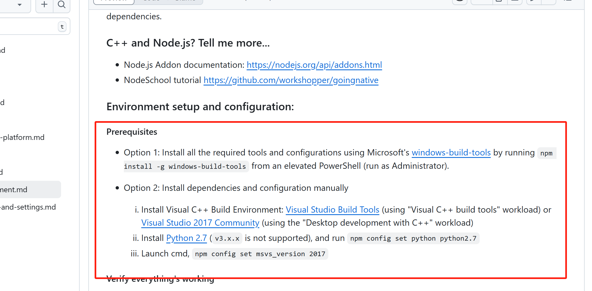

## 执行使用
npm start 

借鉴了 https://github.com/fanchenggang/wechat-ocr-go 和 https://github.com/swigger/wechat-ocr
## 本项目是一个js版本的本地化调用微信OCR的程序,不能商用

其中的`wcocr.dll`是从[wechat-ocr-go](https://github.com/fanchenggang/wechat-ocr-go)这个项目里直接拉下来的，适用于3版本的微信的`wechatOcr.exe`，4版本的有点变化，具体可以看[wechat-ocr](https://github.com/swigger/wechat-ocr)里面的md介绍。

## 由于需要c#写的函数，所以需要你本地有c#开发环境，下面是我的配置
1. node版本是14
2. 本地的visual Studio是2017的，没有的话，去网上找一个installer。PS：不是vscode。
3. 用管理员权限打开powerShell，npm install --global --production windows-build-tools
4. 下面的操作在vscode或者普通的cmd里面就可以了，npm config set msvs_version 2017
5. npm config set python python2.7 顺便记得下载2.7版本的python
6. npm i node-gyp -g  
7. 如果顺利的话，你可以正常 npm install ffi-napi 这一步成功了的话，后续就没有啥问题了

下面是node-gyp安装的官网的截图

## 设置本地微信ocr相关路径
设置自己的weChatOcr.exe路径和微信安装路径（mmmojo.ddl）在的那个path，可以用everything 这个工具搜索weChatOcr.exe和mmmojo.ddl

## 使用和结果
你本地的png文件路径替换到 `testImage` 这个变量，和微信截图后的提取文字一样，你会获得全部的提取的文字

## 初衷
刷掘金看到了，发现没有js版本的，真的很好奇这种反向工程，顺便想学习一下，所以花两天时间研究了一下，确实有很多坑，对于没有系统学习过c#的我来说，完全一片空白，不过还好整出来了，后面大家可以自己玩玩拓展

坑1：安装node-gyp

坑2：不懂ddl

本身js代码还是超级简单的

